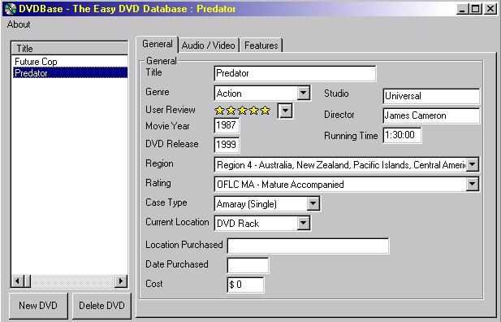

<div align="center">

## DVDBase 0\.51


</div>

### Description

A DVD Collection database. Uses a VB front end, and ADO to get information out of an Access database.
 
### More Info
 


<span>             |<span>
---                |---
**Submitted On**   |2002-12-10 13:28:08
**By**             |[Mark Nemtsas](https://github.com/Planet-Source-Code/PSCIndex/blob/master/ByAuthor/mark-nemtsas.md)
**Level**          |Advanced
**User Rating**    |4.9 (34 globes from 7 users)
**Compatibility**  |VB 6\.0
**Category**       |[Complete Applications](https://github.com/Planet-Source-Code/PSCIndex/blob/master/ByCategory/complete-applications__1-27.md)
**World**          |[Visual Basic](https://github.com/Planet-Source-Code/PSCIndex/blob/master/ByWorld/visual-basic.md)
**Archive File**   |[DVDBase\_0\_15119012122002\.zip](https://github.com/Planet-Source-Code/mark-nemtsas-dvdbase-0-51__1-41517/archive/master.zip)

### API Declarations

```
Public Declare Function WritePrivateProfileString Lib "kernel32" Alias "WritePrivateProfileStringA" (ByVal lpApplicationname As String, ByVal lpKeyName As Any, ByVal lsString As Any, ByVal lplFilename As String) As Long
Public Declare Function GetPrivateProfileInt Lib "kernel32" Alias "GetPriviteProfileIntA" (ByVal lpApplicationname As String, ByVal lpKeyName As String, ByVal nDefault As Long, ByVal lpFileName As String) As Long
Public Declare Function GetPrivateProfileString Lib "kernel32" Alias "GetPrivateProfileStringA" (ByVal lpApplicationname As String, ByVal lpKeyName As String, ByVal lpDefault As String, ByVal lpReturnedString As String, ByVal nSize As Long, ByVal lpFileName As String) As Long
Public Declare Function GetTickCount Lib "kernel32" () As Long
```


